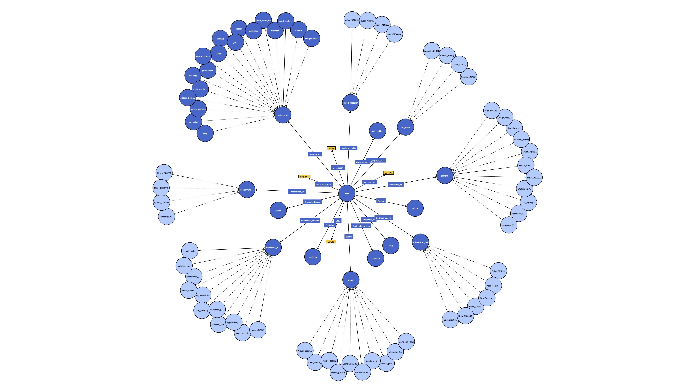

# LabEL Wikidata bot documentation

# Overview

> ⚠️ **Warning:** To avoid accidental vandalism to Wikidata, it is critical that the data provided to the bot is correct and adheres to the [policies and guidelines](https://www.wikidata.org/wiki/Wikidata:List_of_policies_and_guidelines), including the [notability criterion](https://www.wikidata.org/wiki/Wikidata:Notability).

This bot automates item creation and population on [Wikidata](https://www.wikidata.org/) for electronic literature works archived by the [Laboratory for Electronic Literature](https://www.kbr.be/en/projects/laboratory-for-electronic-literature/) (LabEL) at KBR. It allows archivists to efficiently and accurately upload large amounts of structured data, in accordance with Wikidata [policies and guidelines](https://www.wikidata.org/wiki/Wikidata:List_of_policies_and_guidelines).

The script runs locally and interacts with the Wikidata API to make changes to the live database. It reads from a CSV, checks for the existence of items based on title and QID, creates items where they do not exist, and adds statements about the works as outlined in the LabEL ontology recorded [here](https://www.wikidata.org/wiki/Wikidata:WikiProject_Digital_Narratives/LabEL). Please refer to the graph below for an overview of the current ontology.


_Figure 1: Visualisation of the LabEL ontology._

Pre-existent items and statements are skipped to prevent erroneous edits. After execution, a CSV file is created of the change history, summarising all actions taken or skipped, allowing users to review manually and adjust items the bot identified as too risky to edit automatically.

# Installation instructions

## Requirements

- Python 3.12 or higher
- Pandas 2.2.3
- A local clone of this repository

## Installation

Clone the repository locally for usage and development purposes. Scripts should be run from the `/core` directory using `pwb.py`. This differs from installing Pywikibot via `pip`, where scripts can be executed directly without referencing `pwb.py`.

Clone this directory locally using `git`:

```bash
git clone https://github.com/Palinghamer/KBRobot.git
```

Navigate to `/core` :

```bash
cd pywiki/core
```

## Configuration login

To get started, create your `user-config` file using `generate_user_files.py`, this file contains the [Wikidata domain you intend to edit, as well as your login credentials](https://www.wikidata.org/wiki/Wikidata:Pywikibot_-_Python_3_Tutorial/Setting_up_Shop#Configuration).

> ⚠️ **Warning:** The configuration determines which Wikimedia site the bot will edit. When testing, the language and domain should be set to “test” to avoid edits to the live website.

Generate your `user-config` file:

```bash
python pwb.py generate_user_files.py #enter wikidata, wikidata + login
```

This will create a file in the `/core` directory named `user-config.py`. Once the file has been created, it can also be edited manually.

Log in using `login`:

```bash
python pwb.py login #enter pw
```

If you are uncertain for which website or account your current session has been configured, repeat the same command.

# Usage instructions

## How does it work?

Once called, the bot loops through each item in the file (e.g., works or authors). For each item, it first checks if it was already assigned a QID. If not, it searches Wikidata using the item’s title. If a matching item is found, it is skipped to let the user review this item manually to avoid potential errors. If no match is found, a new Wikidata item is created, and its QID is written to the CSV. The bot then adds descriptions, statements, and sources to the item. Statements are created using the property codes from the column headers and their corresponding row values. If an identical statement already exists, it is skipped to prevent duplication. Users can review these skipped statements if needed.

> ⚠️ **Warning:** The script is time-gated by default and can only be ran once every 5 minutes. This is to prevent unintended duplicate edits to Wikidata. While the bot checks for duplicate items and statements, these safeguards are limited by the refresh rate of Wikidata’s indexing. Running the script multiple times in quick succession may thus result in duplicate items or statements.

To avoid overloading the API, the bot also periodically pauses between requests. Moreover, upon creating a new item, it enters a sleep cycle checking every minute if the new item has been indexed. If the item appears within 10 minutes, the script continues adding statements. Otherwise it moves on to the next item. QIDs for all newly created items are saved to the CSV, so skipped items can be edited manually or automatically processed by rerunning the script. These pauses are thus desired behaviour; simply wait for the script to complete, then check the change history for a summary of what was updated or skipped.

## Data

The bot takes a structured CSV containing QIDs, titles, properties, items and values to be added to Wikidata. Templates can be found in `/core/data`. New formats can be created, but the structure of these CSVs should match the structure outlined in the `config.json` files at `/pywikibot/scripts/configs`.

For a detailed explanation on how values should be entered into the CSV, please refer to the **_annotation guidelines_** [chapter needed]**_._** For information on the `config` files, please refer to the subchapter [Creating new CSV & `config` files for new item types](https://www.notion.so/Creating-new-CSV-config-files-for-new-item-types-1f1b2c9a97908051b2ecee8e6d849a86?pvs=21)

## Running the bot

The script comes preconfigured to create and populate work or author items and can be called on any CSV file. As for this setup, the repository is cloned locally, it is necessary to use `pwb.py` to run scripts.

Before running the bot, make sure you are logged into the correct account and to the **_correct Wikimedia website_**. From the `/core` directory, run `login`:

```bash
python pwb.py login #enter pw
```

To run the bot, call `prototype_main.py` on the CSV file containing the data that you want to upload. The example below uses a relevant path to the data folder that is used to store the data sets, but the script can be called on any CSV file that is correctly structured:

```bash
python [pwb.py](http://pwb.py/) prototype_main.py data/test_data.csv
```

The script is preconfigured to create and populate items for authors _or_ for works. To begin uploading authors, call with the `--mode author` argument:

```bash
python [pwb.py](http://pwb.py/) prototype_main.py data/test_data.csv --mode author
```

For works use `—mode work`:

```bash
python [pwb.py](http://pwb.py/) prototype_main.py data/test_data.csv --mode work
```

Note: If no mode is specified, the script defaults to `work` mode.

Before starting, the script will prompt the user to confirm pressing `Y` + `enter`:

```bash
You are about to run the script in AUTHOR mode. Editing Wikidata using the incorrect mode will result in unintended changes.
--- Continue? (Y/N):
```

Let the script run. A summary of actions undertaken or skipped will appear in the terminal upon completion, and a change history file will be added to the `/logs` folder for the user to validate the output.

## Change history and logs

Every time the script is ran, two files are created: a CSV file containing the history of changes made, and a .log file containing debugging information. Both are saved with timestamps in the folder `/logs` in the project root.

If there is any uncertainty about the validity of an edit, the bot avoids actions like item creation or statement setting. It is therefore necessary for the user to validate the output, and to manually make edits to Wikidata where the bot did not.

The user can refer to the change history to keep track of which items were created or which statements or sources were set, and which were skipped. The change history comes in a CSV file which can be filtered based on different variables, such as if an action was taken or skipped. This file is structured as follows:

| **Title**             | **QID** | **Type** | **Action** | **Property** | **Value** |
| --------------------- | ------- | -------- | ---------- | ------------ | --------- |
| Aphorisms about birds | Q239198 | Claim    | Skipped    | P82          | Q215175   |
| Aphorisms about birds | Q239198 | Source   | Created    | P149         | Q239104   |

For debugging purposes, there is also a log with information about errors or skips. For future changes, this logging could be expanded.

## Creating new CSV & `config` files for new item types

It is possible to add custom profiles to upload items that are not authors or works (such as events, for example). This can by done by defining your own CSV structure, mirroring its logic in a `config.json` file stored in the `/configs` folder, and adding this configuration as a `—-mode` in `profiles.json`.

As noted above, Wikidata statements consist of a property and a corresponding value. In the CSV file, each column header represents a **property ID**, and the values in the rows represent the **value** for that property. To define statements, enter the **property ID** (e.g., `P31`) as the column header and provide the appropriate value in each row (such as QIDs, dates, URLs, sources, etc.).

> ⚠️ **Warning:** The first two columns of the CSV must _always_ be “**Title**” and “**QID**”. These are fixed and should **not** be renamed or reconfigured, as they are critical for identifying, populating, or creating each item accurately.

The CSV’s can be located anywhere on your machine, but there is dedicated folder reserved for data files at the relative path `/core/data` where the template CSV’s for work and author items are saved.

Next, to ensure that statements are correctly set, it is necessary to specify the expected data types of the properties in the `config.json` , which can be found at the relative path `/pywikibot/scripts/configs`. This allows the configuration to translate CSV column data into structured statements with appropriate data types. The configuration files mirror the structure of the corresponding CSV files, specifying properties and their associated sources. For example, for data related to a work:

```json
{
  "property_map": {
    "P50": { "property": "P50", "type": "string" },
    "P767": { "property": "P767", "type": "string" },
    "P761": { "property": "P761", "type": "date" },
    "P145": { "property": "P145", "type": "item" },
    "P31": { "property": "P31", "type": "string" },
    "P31_2": { "property": "P31", "type": "string" },
    "P82": { "property": "P82", "type": "item" }
  },
  "source_map": {
    "P149": { "property": "P149", "type": "item", "targets": ["P82"] }
  }
}
```

As visible in the example, this is a JSON file consisting of two main sections: `property_map` and `source_map`. The `property_map` defines the properties expected in the CSV file. Each key corresponds to a column header in the CSV, and the value is an object specifying: the target **property ID**, the data type of the **value** (e.g. , “string”, “date”, or “item”). The `source_map` is used to define references or sources for the data. Each entry represents a **source property** and includes: the **source property ID**, the type of source, **and an array listing which properties in the `property_map` this source applies to.**

Note that it is not strictly necessary to add entries to `property_map` or `source_map` if you are not including statements or sources in your setup. However, both keys should still be present in the configuration file and can be left empty if unused.

Finally, to add the configuration as a `--mode`, add a new key-value pair to the `profiles.json` file in `/pywikibot/scripts`, where the key is the mode name and the value is the relative path to the `config.json` file:

```json
{
  "author": "configs/config_authors.json",
  "work": "configs/config_works.json"
}
```

You can now run the bot with this logic by specifying your newly created `--mode` in the same way you would for works or authors.

# Structure of the code

The bot is built on a clone of the [Pywikibot](https://github.com/wikimedia/pywikibot) library. Documentation can be found [here](https://doc.wikimedia.org/pywikibot/stable/), and a full tutorial for the use of Pywikibot for Wikidata can be found [here](https://www.wikidata.org/wiki/Wikidata:Pywikibot_-_Python_3_Tutorial).

While the complete tree of the project is much larger, below is an overview of the most important files and folders.

- **`logs/`** – Contains change history and log files.
- **`ontology/`** – Holds an approximate model of the ontology in Turtle format, along with visualisations.
- **`core/`** – Includes the complete library and custom scripts.
- **`data/`** – Used for storing CSV files.
- **`pywikibot/scripts/`** – Contains custom scripts organised into modules, which are imported by the main script, `prototype_main.py`. This is also where the configuration and profile files are located.

```bash

pywiki
├── logs/
├── ontology/
├── core/
│   ├── data/
│   ├── user_config.py
│   ├── pywikibot/
│   │   └── scripts/
│   │       ├── configs/
│   │       │   ├── config_works.json
│   │       │   ├── config_authors.json
│   │       │   └── config_custom.json
│   │       ├── generate_user_files.py
│   │       ├── prototype_main.py
│   │       ├── profiles.json
│   │       └── uploader.py
```

When making contributions to the code, please store your code in `pywikibot/scripts`.
