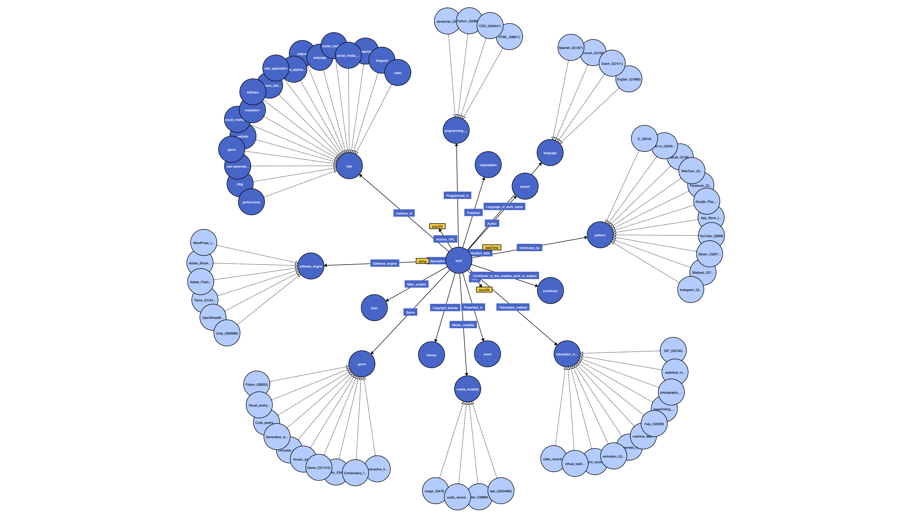

# KBRobot

This project automates item creation and population on [Wikidata](https://www.wikidata.org) for electronic literature works archived by the [Laboratory for Electronic Literature](https://www.kbr.be/en/projects/laboratory-for-electronic-literature/) at KBR. Metadata about the works are encoded according to the LabEL ontology recorded [here](https://www.wikidata.org/wiki/Wikidata:WikiProject_Digital_Narratives/LabEL).

The bot takes a structured .CSV file, checks for existing items based on the title of the work, creates a new item if none exist, and adds the recorded claims and sources automatically. FFor this reason, it is critical that the data provided to the bot is correct and adheres to [Wikidata policies and guidelines](https://www.wikidata.org/wiki/Wikidata:List_of_policies_and_guidelines), particularly the [notability criterion](https://www.wikidata.org/wiki/Wikidata:Notability).

Please refer to the graph below for a graph of the current ontology model.

_Figure 1: Visualisation of the LabEL ontology._

<u>**Note:**</u> this schema serves to help understand the RDF and does not fully reflect the logic of the actual Wikidata model. Properties and their targets are represented as classes and subclasses rather than items and properties. Some nodes have been renamed for readability.

### Upcoming changes

- [ ] Support for dates
- [ ] Logging changes made
- [ ] Guidelines for structured data entry
- [ ] Documentation for scripts & pywikibot
